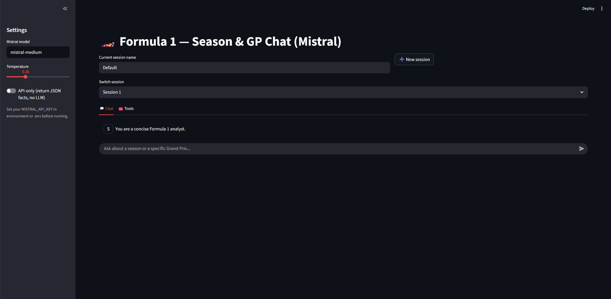

# 🏎️ F1 Chat App — Streamlit

An interactive AI assistant to explore Formula 1 seasons and Grand Prix sessions using **OpenF1** and **Ergast** APIs, with intelligent text generation powered by **Mistral**. The LLM is using the fact extract on the data base for answer to a query.

---

## 🚀 Features
- 💬 Ask natural language questions about a **season**, a **Grand Prix**, or a **specific session** (FP1/FP2/FP3/Qualifying/Sprint/Race).  
- 📊 Generates detailed summaries: results, DNFs, fastest laps, pace comparisons (in dev)…  
- 🧠 Uses a Large Language Model (Mistral) to generate an answer that concords to the querry.  


---

## 💬 Example queries (for testing or screenshots)

### 🔹 Grand Prix summaries

| Example | Prompt |
|----------|---------|
| **Race** | `Summarize the Bahrain Grand Prix 2024` |
| **Driver result race** | `Summarize the race of Leclerc in Monacio 2024` |
| **Season** | `Summarize 2022 season` |

## 📸 Suggested screenshots

| Prompt | Image |
|---------|--------|
| App home screen with input box |  |
| `Summarize Monaco 2024 race` |  |
| `Who DNF in Canada 2025 ?` |  |
| `What is the result of Lando Norris at Suzuka 2023 gp ?` |  |
| `Season 2024: Who had the most wins in the 2024 season?` |  |


---

## 🧱 Requirements
- Python **3.11+**
- API keys:
  - `MISTRAL_API_KEY`
  - `OPENF1_BASE` (optional, defaults to `https://api.openf1.org/v1`)
- Internet connection (HTTPS)

---

## 📦 Installation

```bash
# 1. Clone the repository
git clone https://github.com/<your_username>/f1_chat_app.git
cd f1_chat_app

# 2. Create the environment
python -m venv .venv
source .venv/bin/activate   # Windows: .venv\Scripts\activate

# 3. Install dependencies
pip install -r requirements.txt

# 4. Set environment variables
export MISTRAL_API_KEY="sk-..."
export OPENF1_BASE="https://api.openf1.org/v1"

# 5. Run the app
streamlit run app.py


	
